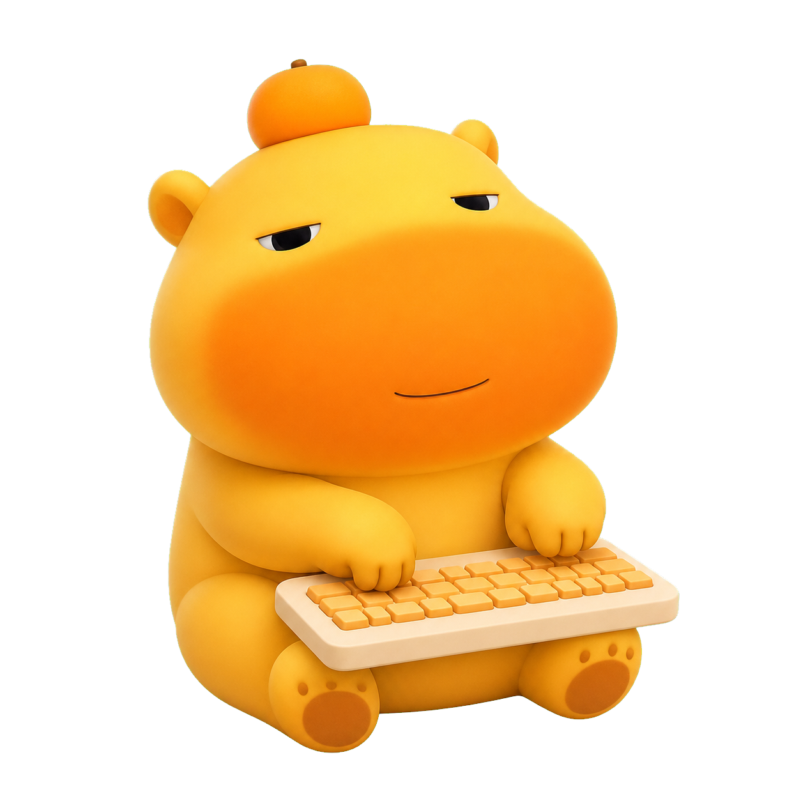

# ⌨️ 噜噜桌宠 🐾

<p align="center">
  
</p>

<p align="center">
  <strong>让噜噜陪你敲键盘，悄悄记录今天的努力 ฅ՞•ﻌ•՞ฅ</strong>
</p>

这是一个可爱的 Windows 桌面宠物，也是一款完全本地运行的键盘、鼠标使用量统计器。

你敲一下键盘，噜噜也会跟着动动小手认真敲一下！( •̀ ω •́ )✧

## ✨ 噜噜会做什么？

- 🧡 安静待在桌面上，可以用鼠标拖到喜欢的位置
- 📏 默认大小为 170 px，右键可切换 135、170、220 px 三档
- ⌨️ 按键时噜噜会动动手指，身体不会跟着上下跳
- 🔢 角标显示今天的键盘按键总数和鼠标点击总数
- 📊 点击角标即可打开详细统计
- 🔤 分别统计字母、数字、功能键、编辑键、媒体键和数字键盘
- ↔️ 可以区分左右 Shift、Ctrl、Alt 等独立按键
- 🖱️ 分别统计鼠标左键、右键、中键、侧键和滚轮方向
- 🌙 每天独立保存记录，还可以查看前一天的数据
- 💤 右键可以暂停统计、调整大小、切换置顶状态或让噜噜休息

## 📦 下载与安装

普通用户可以前往项目右侧的 **Releases** 页面，下载最新的：

```text
LuluDesktopPet-Setup-版本号.exe
```

双击安装包，跟随向导安装即可。

> [!NOTE]
> 安装包暂时没有商业代码签名。Windows 可能显示“未知发布者”，此时可以点击“更多信息”→“仍要运行”。

## 🚀 从源码运行

已经构建完成时，双击：

```text
启动噜噜.bat
```

需要重新构建时，在 PowerShell 中执行：

```powershell
powershell -ExecutionPolicy Bypass -File .\build.ps1
```

构建后的程序位于：

```text
dist\LuluDesktopPet.exe
```

## 🔐 隐私说明

噜噜很乖，不会偷看你写了什么！(｡•̀ᴗ-)✧

程序只保存每天每个独立按键的**累计次数**，例如：

```text
A：123 次
Space（空格）：456 次
鼠标左键：789 次
```

程序不会保存：

- ❌ 按键发生的先后顺序
- ❌ 输入过的文字或密码
- ❌ 当前窗口和软件名称
- ❌ 任何网络上传数据

所有统计数据只保存在本机：

```text
%LOCALAPPDATA%\LuluDesktopPet\stats.json
```

## 🛠️ 制作安装程序

项目使用 Inno Setup 7 制作 Windows 安装包：

```powershell
powershell -ExecutionPolicy Bypass -File .\package-installer.ps1
```

生成结果位于：

```text
installer-output\
```

安装程序支持开始菜单快捷方式、可选桌面快捷方式、可选开机启动以及标准卸载。

## 🎨 关于噜噜

目前的 `lulu-typing.png` 和 `lulu-typing-press.png` 是根据视觉参考制作的两帧临时敲击动画。之后还会继续完善噜噜的待机动作、表情和更多互动状态。

> [!IMPORTANT]
> 仓库中的程序代码采用 Apache-2.0 许可证；角色形象与图片素材不属于该代码许可证的授权范围。目前素材仅作为开发占位，请勿直接用于商业用途。

---

<p align="center">
  希望噜噜可以陪你度过每一个认真敲键盘的日子～ (´▽`ʃ♡ƪ)
</p>
